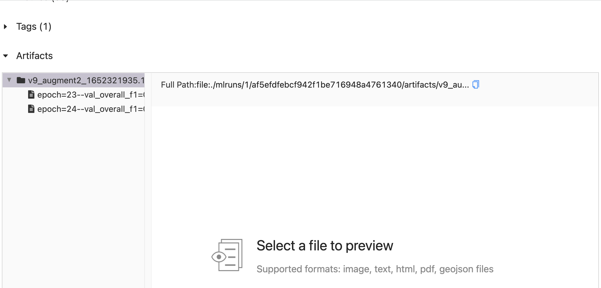
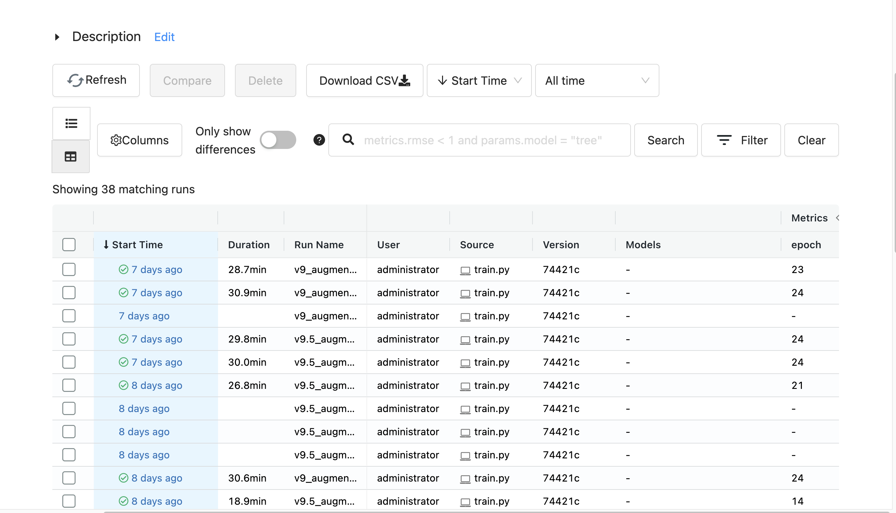

#### Tabel of contents
1. [Setup environments](#setup)
2. [Data preprocess](#dataset)
3. [Training](#training)
4. [Monitoring](#monitoring)
<p align="center">
  <h1 align="center", id="introduction">NAMED ENTITY RECOGNITION</h1></p>

## Setup environments<a name="setup"></a>
### Install pytorch
Install torch version that is compatible with your cuda version
### Create python environment
Create your virtual environment and install dependencies:
```angular2html
pip install -r requirements.txt
```

## Data preprocess<a name="dataset"></a>
Following the tutorial in [datapreparation_tutorial.ipynb](./datapreparation_tutorial.ipynb) file

## Training<a name="training"></a>
Custom `tags_list` variable in `train.py` file to compatible with your task

```angular2html
python3 train.py --help
```
Training script example:
```angular2html
python3 train.py --run_name specific-run-name --dataset_version final-dataset --label_all_tokens True --warmup_steps 500 --num_epochs 25
```
The 2-best weight is saved in Artifacts of this experiment. Example:

## Monitoring<a name="monitoring"></a>
In the project, we use [MLflow](https://www.mlflow.org/docs/latest/quickstart.html) to monitor, log and track all experiments. Run script below to view the Tracking UI:
```angular2html
mlflow ui
```
MLflow UI :
